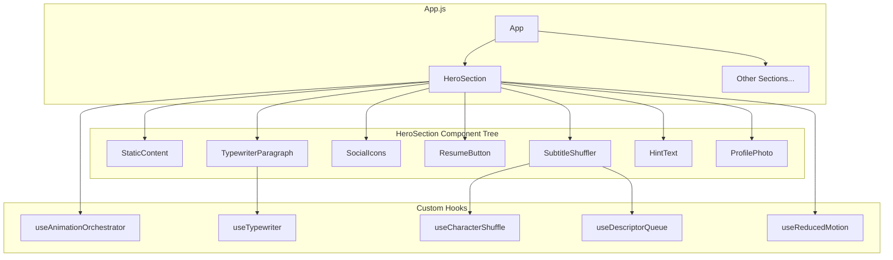

# Design Document: Hero Section Redesign

## Overview

This design replaces the existing parallax-based hero (`LandingPage.js` / `LandingPage.css`) with a modern, text-forward, animated hero section. The new hero features an orchestrated entrance animation timeline, an interactive subtitle shuffle game, inline social icons, and a cinematic profile photo treatment.

The implementation builds on the existing React 19 + Framer Motion 12.4 + react-intersection-observer stack. No new dependencies are introduced — the character shuffle is implemented as a custom hook using `requestAnimationFrame` rather than adding a third-party scramble library, keeping the bundle lean.

**Key design decisions:**
- **Custom animation orchestrator** over Framer Motion variants/staggerChildren — the hero timeline is sequential with heterogeneous animations (typewriter, pulse, type-delete-retype) that don't fit a uniform stagger pattern
- **useRef-based "has played" flag** over sessionStorage — animation should replay on page refresh (new mount) but not on scroll-back (same mount)
- **CSS custom properties** for all colors — enables future light/dark theme toggle without component changes
- **Single component file with extracted hooks** — keeps the hero self-contained while allowing unit testing of animation logic

---

## Architecture



**Data flow:**
1. `useAnimationOrchestrator` manages the timeline, exposing phase states to child components
2. Each child component reads its animation phase and renders accordingly
3. `useReducedMotion` is read once at mount and passed down — when active, all components skip to final state
4. `useDescriptorQueue` manages the subtitle array rotation independently of animation timeline
5. User interactions (tap subtitle, click resume) are handled locally within their respective components

---

## Components and Interfaces

### HeroSection (Container)

The root component that owns layout, orchestration state, and reduced motion detection.

```typescript
// src/components/HeroSection/HeroSection.js
interface HeroSectionProps {
  // No props — self-contained, reads data internally
}

// Internal state managed by useAnimationOrchestrator
type AnimationPhase = 
  | 'idle'           // Before mount (never visible)
  | 'typewriter'     // 0.0s–0.8s: paragraph typing
  | 'icons'          // 0.8s–1.4s: social icons pulsing
  | 'button'         // 1.4s–2.1s: resume button type-delete-retype
  | 'complete'       // 2.1s+: all entrance done, hint fades in at ~2.5s
```

**Responsibilities:**
- Renders the two-column (desktop) or stacked (mobile) layout via CSS Grid
- Passes `currentPhase` and `isReducedMotion` to children
- Owns the `hasPlayed` ref to prevent re-triggering on scroll-back

---

### StaticContent

Renders the h1 name and subtitle (which is interactive via SubtitleShuffler).

```typescript
// Renders immediately — no animation dependency
interface StaticContentProps {
  // None — content is static, subtitle delegated to SubtitleShuffler
}
```

---

### TypewriterParagraph

Reveals the intro paragraph character by character.

```typescript
interface TypewriterParagraphProps {
  text: string
  isActive: boolean          // true when phase === 'typewriter'
  isReducedMotion: boolean
  onComplete: () => void     // signals orchestrator to advance
}
```

**Implementation approach:**
- Uses `useTypewriter(text, duration)` hook internally
- Hook uses `requestAnimationFrame` loop to calculate how many characters to show based on elapsed time
- Total duration: ~800ms regardless of text length (characters per frame varies)
- When `isReducedMotion` is true, renders full text immediately and calls `onComplete` on mount

---

### SocialIcons

Displays GitHub, LinkedIn, Email links with sequential pulse-then-gray entrance.

```typescript
interface SocialIconsProps {
  isActive: boolean          // true when phase === 'icons'
  isReducedMotion: boolean
  onComplete: () => void
}

interface SocialLink {
  name: string
  href: string
  icon: React.ReactNode      // SVG component
  brandColor: string         // for pulse animation
  ariaLabel: string          // minimal — just the platform name for screen readers
}
```

**Implementation approach:**
- Icons rendered inline (inline-flex) after the paragraph
- When `isActive` becomes true, each icon animates in sequence with ~150ms stagger:
  1. Icon appears at full brand color
  2. Pulse OUT (scale up to ~1.2 + brand color glow) 
  3. Snap back to normal scale
  4. Fades to gray (desaturated) resting state
  5. Next icon begins immediately
- Total sequence: 3 icons × ~150-200ms = ~500-600ms
- Resting state: all icons are gray/muted
- On hover (desktop) / tap (mobile): hovered icon turns colorful again + single pulse animation
- Only 3 social icons inline (GitHub, LinkedIn, Email) — Resume has its own dedicated button below
- No visible text labels — icons are recognizable; `aria-label` provides accessibility

---

### ResumeButton

CTA button with type-delete-retype entrance animation.

```typescript
interface ResumeButtonProps {
  isActive: boolean
  isReducedMotion: boolean
  onComplete: () => void
  resumeUrl: string
}
```

**Animation sequence (when active):**
1. Type "or just" (0.0–0.3s relative)
2. Pause (0.3–0.5s relative)
3. Delete "or just" (0.5–0.7s relative)
4. Type "Download Resume" (0.7s+ relative, stays)

Uses the same `useTypewriter` hook in forward and reverse modes.

---

### SubtitleShuffler

Interactive subtitle with character shuffle animation on tap/click.

```typescript
interface SubtitleShufflerProps {
  isReducedMotion: boolean
}

// Internal state
interface ShufflerState {
  currentText: string
  isShuffling: boolean
  tapCount: number
  isGameOver: boolean
  showRestart: boolean
}
```

**Implementation approach:**
- Uses `useDescriptorQueue` for array rotation logic
- Uses `useCharacterShuffle(targetText, duration)` for the animation
- Character shuffle: each character position cycles through random alphanumeric characters, resolving left-to-right over ~400ms
- After 8 taps, switches to end messages mode
- `aria-live="polite"` region wraps the subtitle text for screen reader announcements
- When `isReducedMotion` is true, text swaps instantly (no shuffle animation)

---

### HintText

Subtle prompt that appears after all entrance animations complete.

```typescript
interface HintTextProps {
  isVisible: boolean         // true after phase === 'complete' + 400ms delay
  onDismiss: () => void      // called on first subtitle interaction
}
```

**Behavior:**
- Fades in with `opacity: 0→1` over 300ms
- Dismissed permanently on first subtitle tap (parent manages state)
- Never reappears during current page load

---

### ProfilePhoto

Background photo element with gradient edge treatment.

```typescript
interface ProfilePhotoProps {
  // No animation props — renders statically at mount
}
```

**CSS treatment:**
- `opacity: 0.75` (within 70–85% range)
- Gradient overlay via `::after` pseudo-element: `linear-gradient(to right, var(--bg-primary), transparent 40%)`
- Positioned with CSS Grid (column 2 on desktop, row 2 on mobile)
- `object-fit: cover` to fill the allocated space

---

## Custom Hooks

### useAnimationOrchestrator

```typescript
function useAnimationOrchestrator(isReducedMotion: boolean): {
  currentPhase: AnimationPhase
  advancePhase: () => void
}
```

- Manages the sequential timeline via a state machine
- When `isReducedMotion` is true, immediately sets phase to `'complete'`
- `advancePhase` is called by each child's `onComplete` callback
- Phase transitions: `idle` → `typewriter` → `icons` → `button` → `complete`
- A `useRef(hasPlayed)` prevents re-initialization if the component re-renders due to scroll visibility changes

### useTypewriter

```typescript
function useTypewriter(
  text: string,
  duration: number,
  isActive: boolean
): {
  displayText: string
  isComplete: boolean
}
```

- Uses `requestAnimationFrame` to calculate visible character count based on elapsed time
- `displayText` is always a prefix of `text` (characters 0 through N)
- Returns `isComplete: true` when all characters are revealed
- Can be used in reverse mode for the delete animation (decrement character count)

### useCharacterShuffle

```typescript
function useCharacterShuffle(
  targetText: string,
  duration: number,     // ~400ms
  trigger: boolean      // starts shuffle when true
): {
  displayText: string
  isComplete: boolean
}
```

- On trigger, starts a `requestAnimationFrame` loop
- Each frame: characters resolve left-to-right based on elapsed percentage
- Unresolved characters show random alphanumeric characters (A-Z, 0-9)
- After `duration` ms, all characters are resolved to `targetText`
- Character set: `ABCDEFGHIJKLMNOPQRSTUVWXYZabcdefghijklmnopqrstuvwxyz0123456789`

### useDescriptorQueue

```typescript
function useDescriptorQueue(initialItems: string[]): {
  current: string
  next: () => string
  tapCount: number
  isGameOver: boolean
  reset: () => void
}
```

- Maintains a queue (array with front pointer)
- `next()` returns the next item, moves the pointer forward
- After showing ~8 items, transitions to end messages
- End messages rotate on continued taps
- `reset()` restores the queue to initial order and resets tap count

### useReducedMotion

```typescript
function useReducedMotion(): boolean
```

- Reads `window.matchMedia('(prefers-reduced-motion: reduce)')` on mount
- Listens for changes (user can toggle system preference mid-session)
- Returns `true` when reduced motion is preferred

---

## Data Models

### Hero Content Data

```javascript
// src/components/HeroSection/heroData.js

export const heroContent = {
  name: 'Shivansh Gaur',
  initialSubtitle: 'iOS Developer',
  paragraph: 'I craft native iOS experiences for apps used by millions. Currently building at Natwest, previously shaped products at BlackNGreen and Tech Mahindra.',
  hintText: 'tap to discover more about me',
  resumeUrl: `${process.env.PUBLIC_URL}/assets/resume/Shivansh_Gaur_Resume.pdf`,
}

export const descriptorItems = [
  'iOS Developer',
  'Software Engineer', 
  'Swift Enthusiast',
  'Good Cook',
  'Excellent Baker',
  'Technical TT Player',
  'Nature Lover',
  'Homo Sapien',
  'Vegetarian',
  'Blind in Love',
]

export const endMessages = [
  'Alright, you know enough. Scroll down to see the real stuff.',
  'Careful — learning too much won\'t make us friends.',
  'That\'s the full list. Now go explore the rest.',
  'Still here? There\'s way more to see below.',
]

export const socialLinks = [
  {
    name: 'GitHub',
    href: 'https://github.com/ShivanshGaur6096',
    brandColor: '#8b5cf6',  // purple
    ariaLabel: 'GitHub',    // kept minimal — for screen readers only
  },
  {
    name: 'LinkedIn',
    href: 'https://www.linkedin.com/in/shivanshgaur',
    brandColor: '#0077b5',
    ariaLabel: 'LinkedIn',
  },
  {
    name: 'Email',
    href: 'mailto:shivanshgaur96@gmail.com',
    brandColor: '#ea4335',
    ariaLabel: 'Email',
  },
]
```

### Animation Timeline Configuration

```javascript
export const animationTimeline = {
  typewriter: {
    startDelay: 0,        // starts immediately
    duration: 800,        // ms
  },
  icons: {
    stagger: 150,         // ms between each icon entrance
    pulseDuration: 200,   // ms per icon pulse (appear → pulse out → snap back → gray)
    grayTransition: 100,  // ms to fade from color to gray resting state
    // total: ~500-600ms (3 icons × ~180ms each)
    // Resting state: all icons gray/muted
    // On hover: icon turns colorful + single pulse
  },
  button: {
    typePhase1: 300,      // "or just" typing duration
    pauseDuration: 200,   // pause before delete
    deletePhase: 200,     // deletion duration
    typePhase2: 300,      // "Download Resume" typing duration
    // total: ~700ms relative
  },
  hint: {
    appearDelay: 400,     // ms after 'complete' phase
    fadeDuration: 300,    // opacity transition
  },
  shuffle: {
    duration: 400,        // character shuffle resolve time
  },
}
```

---

## Correctness Properties

*A property is a characteristic or behavior that should hold true across all valid executions of a system — essentially, a formal statement about what the system should do. Properties serve as the bridge between human-readable specifications and machine-verifiable correctness guarantees.*

### Property 1: Typewriter produces increasing prefixes

*For any* input string of length N, at any point during the typewriter animation, the displayed text SHALL be a prefix of the target string (i.e., `target.substring(0, k)` for some `0 ≤ k ≤ N`), and the character count SHALL only increase monotonically over time.

**Validates: Requirements 3.1, 3.3**

### Property 2: Character shuffle resolves to target

*For any* source string and target string, after the shuffle animation completes (~400ms), the displayed text SHALL exactly equal the target string, with each character position having resolved from random characters to the correct target character.

**Validates: Requirements 6.1**

### Property 3: Descriptor queue produces unique items in FIFO order

*For any* sequence of N draws (where N ≤ array length) from the descriptor queue without a reset, all drawn items SHALL be unique, and each item SHALL be drawn from the front of the queue with previously-shown items appended to the back.

**Validates: Requirements 6.2, 6.3**

### Property 4: Shuffler reset restores initial state

*For any* game state (regardless of tap count or current position), calling reset SHALL restore the descriptor queue to its original order and reset the tap count to zero, such that subsequent draws produce the same sequence as a fresh initialization.

**Validates: Requirements 6.6**

### Property 5: Hint dismissed permanently after first interaction

*For any* sequence of user interactions after the first subtitle tap, the hint text SHALL remain hidden (not re-appear) regardless of subsequent taps, scroll events, or phase changes within the same component lifecycle.

**Validates: Requirements 7.2**

### Property 6: Animation plays exactly once per component mount

*For any* number of visibility state changes (component entering/leaving viewport via scroll), the entrance animation sequence SHALL execute at most once per component mount. The `hasPlayed` flag SHALL be set to true after the first execution and SHALL prevent subsequent executions within the same mount.

**Validates: Requirements 8.1, 8.2**

### Property 7: Reduced motion permits only opacity transitions

*For any* animation in the hero section, when `prefers-reduced-motion: reduce` is active, all transform and positional animations SHALL be skipped (elements appear in final position immediately), and only opacity transitions SHALL be permitted as the sole animation type.

**Validates: Requirements 3.4, 4.5, 5.6, 7.4, 10.3, 10.4**

---

## Error Handling

### Font Loading Failures
- Fonts loaded with `font-display: swap` — system fonts render immediately, design fonts swap in when ready
- No layout shift risk since the hero uses fixed heights and CSS Grid

### Image Loading Failures
- Profile photo has `alt` text for accessibility
- Gradient overlay renders regardless of image load state (applied via CSS pseudo-element on parent)
- If image fails to load, the text content remains fully functional

### Animation Frame Drops
- `requestAnimationFrame` loops calculate state based on elapsed time, not frame count
- Dropped frames result in characters "jumping ahead" rather than falling behind — animation always completes on time
- If the browser tab is backgrounded, `rAF` pauses; animation resumes from where it left off (acceptable since hero is not visible)

### Reduced Motion Detection Failure
- Default to `false` (animations enabled) if `matchMedia` is not supported
- Graceful degradation: animations play normally on older browsers

### Resume Download Failure
- Button uses a standard `<a>` tag with `download` attribute pointing to a public asset
- If the file is missing, the browser handles the 404 natively (no custom error UI needed for a static file)

---

## Testing Strategy

### Unit Tests (Example-Based)

Focus areas:
- **Static rendering**: h1 element exists with correct text, subtitle shows "iOS Developer", social links in correct order with correct hrefs
- **Accessibility**: aria-live region present, aria-labels on all links, h1 heading hierarchy, keyboard operability of resume button
- **Responsive layout**: Verify correct CSS classes/grid template applied at desktop vs mobile breakpoints
- **End state**: After 8 taps, end messages appear; restart icon appears at game-over; resume button triggers download
- **Integration**: Component mounts within App.js without errors, no references to old parallax assets

### Property-Based Tests

**Library:** [fast-check](https://github.com/dubzzz/fast-check) (mature, well-maintained PBT library for JavaScript/TypeScript)

**Configuration:** Minimum 100 iterations per property test.

Each property test references its design document property:

1. **Feature: hero-section-redesign, Property 1: Typewriter produces increasing prefixes**
   - Generate random strings (1–500 chars), random elapsed time values
   - Assert displayed text is always a valid prefix of target

2. **Feature: hero-section-redesign, Property 2: Character shuffle resolves to target**
   - Generate random source/target string pairs
   - Run shuffle to completion, assert final output === target

3. **Feature: hero-section-redesign, Property 3: Descriptor queue produces unique items in FIFO order**
   - Generate random permutations of the descriptor array
   - Draw N items, assert all unique and in expected queue order

4. **Feature: hero-section-redesign, Property 4: Shuffler reset restores initial state**
   - Generate random tap counts (1–20), call reset, then draw items
   - Assert post-reset draws match fresh initialization draws

5. **Feature: hero-section-redesign, Property 5: Hint dismissed permanently after first interaction**
   - Generate random sequences of actions (tap, scroll, wait)
   - After first tap, assert hint remains hidden in all subsequent states

6. **Feature: hero-section-redesign, Property 6: Animation plays exactly once per component mount**
   - Generate random sequences of visibility changes
   - Assert animation callback fired exactly once

7. **Feature: hero-section-redesign, Property 7: Reduced motion permits only opacity transitions**
   - Generate random animation configurations from the system
   - With reduced motion active, assert no transform/translate/scale properties are animated

### Visual / Snapshot Tests
- Snapshot the rendered hero at desktop (1280px) and mobile (375px) widths
- Verify photo gradient overlay appearance
- Verify dark theme CSS variable application

### Manual Testing Checklist
- Full animation sequence plays smoothly at 60fps
- Subtitle shuffle responds to tap on iOS Safari and Android Chrome
- Resume PDF downloads correctly
- Screen reader announces subtitle changes
- Keyboard navigation through all interactive elements
- `prefers-reduced-motion` toggle in browser dev tools skips all animations

---

## File Structure

```
src/components/HeroSection/
├── HeroSection.js          # Container component (layout, orchestration)
├── HeroSection.css         # All hero styles (CSS custom properties, responsive)
├── StaticContent.js        # Name heading (h1)
├── TypewriterParagraph.js  # Animated paragraph
├── SocialIcons.js          # Inline icon links with pulse entrance
├── ResumeButton.js         # CTA with type-delete-retype
├── SubtitleShuffler.js     # Interactive subtitle with shuffle
├── HintText.js             # Dismissable hint prompt
├── ProfilePhoto.js         # Photo with gradient treatment
├── heroData.js             # Content data and configuration
├── hooks/
│   ├── useAnimationOrchestrator.js
│   ├── useTypewriter.js
│   ├── useCharacterShuffle.js
│   ├── useDescriptorQueue.js
│   └── useReducedMotion.js
└── icons/
    ├── GitHubIcon.js       # SVG components
    ├── LinkedInIcon.js
    ├── EmailIcon.js
    └── ResumeIcon.js
```

The existing `src/components/LandingPage.js` and `src/components/LandingPage.css` will be deleted. `App.js` will import `HeroSection` instead of `LandingPage`.

---

## CSS Architecture

### Custom Properties (Hero-Specific)

```css
.hero-section {
  /* Layout */
  --hero-height: 100vh;
  --hero-content-max-width: 1200px;
  --hero-padding-x: var(--space-16);       /* 64px desktop */
  --hero-photo-opacity: 0.75;

  /* Typography (from design system) */
  --hero-name-size: clamp(36px, 5vw, 72px);
  --hero-name-font: 'Syne', system-ui, sans-serif;
  --hero-subtitle-size: clamp(20px, 3vw, 32px);
  --hero-body-size: clamp(16px, 1.2vw, 18px);

  /* Animation */
  --hero-shuffle-duration: 400ms;
  --hero-typewriter-duration: 800ms;
  --hero-pulse-duration: 200ms;
}

@media (max-width: 768px) {
  .hero-section {
    --hero-padding-x: var(--space-6);      /* 24px mobile */
  }
}
```

### Layout Strategy

```css
.hero-section {
  display: grid;
  grid-template-columns: 1fr 1fr;
  grid-template-rows: 1fr;
  height: var(--hero-height);
  align-items: center;
  scroll-snap-align: start;
}

@media (max-width: 768px) {
  .hero-section {
    grid-template-columns: 1fr;
    grid-template-rows: auto auto;
  }
}
```

### Reduced Motion

```css
@media (prefers-reduced-motion: reduce) {
  .hero-section *,
  .hero-section *::before,
  .hero-section *::after {
    animation-duration: 0.01ms !important;
    animation-iteration-count: 1 !important;
    transition-duration: 0.01ms !important;
    transition-property: opacity !important;
  }
}
```

Note: The CSS rule above is a safety net. The primary reduced motion handling is in JavaScript — the `useReducedMotion` hook causes components to render their final state immediately, bypassing Framer Motion animations entirely. The CSS rule catches any edge cases.
