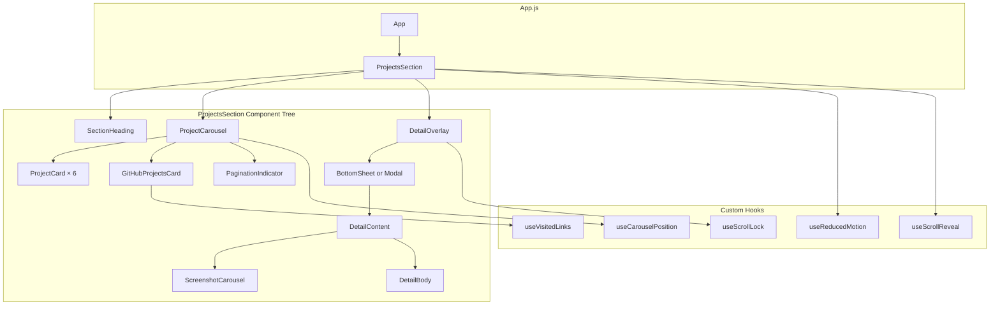

# Design Document: Projects Section

## Overview

This design replaces the existing `src/components/Projects.js` with a fully redesigned Projects section featuring a horizontal carousel with peeking edges, brand-colored project cards, adaptive detail views (bottom sheet on mobile, modal on desktop), and a special GitHub Projects card.

The implementation uses the existing React 19 + Framer Motion 12.4 + react-intersection-observer stack. No new dependencies are introduced — the carousel uses native CSS scroll-snap with a custom hook for position tracking, and body scroll lock is a lightweight utility.

**Key design decisions:**
- **CSS scroll-snap over Framer Motion drag** — native scroll-snap gives free momentum scrolling, accessible swipe, and snap behavior without fighting the browser. Framer Motion handles entrance animations only.
- **Adaptive overlay pattern** (bottom sheet vs modal) determined by viewport width at open time — not reactive (doesn't switch mid-view if user resizes while open).
- **localStorage for GitHub visited state** — simple, no backend required, persists across sessions.
- **Feature-based folder** with co-located hooks, data, and sub-components following established HeroSection pattern.
- **CSS custom properties** for all colors including brand colors — enables theming without component changes.

---

## Architecture



**Data flow:**
1. `ProjectsSection` owns the overlay state (which project is open, or null).
2. `ProjectCarousel` renders cards and tracks scroll position via `useCarouselPosition`.
3. Clicking a card calls `onOpenDetail(projectId)` → parent sets overlay state.
4. `DetailOverlay` reads viewport width to decide between `BottomSheet` or `Modal` rendering.
5. `useScrollLock` activates/deactivates when overlay opens/closes.
6. `useScrollReveal` triggers entrance animation on first viewport entry.
7. `useVisitedLinks` manages localStorage state for the GitHub card's visited indicators.

---

## Components and Interfaces

### ProjectsSection (Container)

Root section component managing layout, overlay state, and scroll-reveal.

```javascript
// src/components/ProjectsSection/ProjectsSection.js

// Internal state
// - openProjectId: string | null — which project detail is open
// - hasRevealed: boolean — whether entrance animation has played

// Responsibilities:
// - Renders <section id="projects"> with heading + carousel
// - Manages which detail view is open
// - Passes scroll-reveal state to children
// - Applies reduced motion detection
```

---

### ProjectCarousel

Horizontal scroll container with CSS scroll-snap and peeking edges.

```javascript
// src/components/ProjectsSection/ProjectCarousel.js

// Props:
// - projects: ProjectData[]
// - activeIndex: number (from useCarouselPosition)
// - onCardClick: (projectId: string) => void
// - isRevealed: boolean (for entrance animation)
// - isReducedMotion: boolean

// Implementation:
// - overflow-x: auto with scroll-snap-type: x mandatory
// - Each card has scroll-snap-align: center
// - Padding on container edges creates the peeking effect
// - IntersectionObserver on each card determines activeIndex
```

**CSS approach for peeking:**
```css
.project-carousel {
  display: flex;
  gap: var(--space-6);
  overflow-x: auto;
  scroll-snap-type: x mandatory;
  scroll-behavior: smooth;
  padding: 0 calc((100vw - var(--card-width)) / 2);
  /* Centers the active card with siblings peeking on edges */
}

.project-carousel__item {
  flex: 0 0 var(--card-width);
  scroll-snap-align: center;
}
```

---

### ProjectCard

Reusable card component for standard project display.

```javascript
// src/components/ProjectsSection/ProjectCard.js

// Props:
interface ProjectCardProps {
  brandColor: string           // CSS custom property value e.g., '#3c1053'
  title: string
  role: string
  description: string
  techStack: string[]
  screenshots: string[]        // image paths
  logo: string                 // fallback when no screenshots
  appStoreLink: string | null
  onClick: () => void
}

// Layout:
// Desktop (>768px): flexbox row — image LEFT, text RIGHT
// Mobile (≤768px): flexbox column — image TOP, text BOTTOM
// Brand color applied as left border (4px solid brandColor) on desktop,
//   top border on mobile
```

---

### GitHubProjectsCard

Special card with white background and capsule list items.

```javascript
// src/components/ProjectsSection/GitHubProjectsCard.js

// Props:
interface GitHubProjectsCardProps {
  repos: GitHubRepo[]
  profileUrl: string
  visitedRepos: Set<string>    // from useVisitedLinks
  onVisit: (repoUrl: string) => void
}

interface GitHubRepo {
  name: string
  url: string
}

// Behavior:
// - White/light background regardless of theme
// - Each repo is a capsule pill with circle indicator + name
// - Click opens repo in new tab AND marks as visited
// - "...more" link at bottom-right
// - Does NOT trigger detail overlay
```

---

### PaginationIndicator

Frosted glass capsule with clickable dots.

```javascript
// src/components/ProjectsSection/PaginationIndicator.js

// Props:
interface PaginationIndicatorProps {
  totalCount: number
  activeIndex: number
  onDotClick: (index: number) => void
  projectNames: string[]       // for aria-labels
}

// Styling:
// - backdrop-filter: blur(20px)
// - background: rgba(255,255,255,0.12)
// - border: 1px solid rgba(255,255,255,0.15)
// - border-radius: 999px
// - Dots: 8px circles, active is filled (--text-primary), inactive is hollow
```

---

### DetailOverlay

Adaptive container that decides between BottomSheet and Modal.

```javascript
// src/components/ProjectsSection/DetailOverlay.js

// Props:
interface DetailOverlayProps {
  project: ProjectDetailData | null  // null = closed
  onClose: () => void
  triggerRef: React.RefObject        // for focus return
}

// Behavior:
// - On open: reads window.innerWidth
// - ≤768px → renders BottomSheet
// - >768px → renders Modal
// - Decision is made at open time, not reactive to resize
// - Activates useScrollLock on open
// - Traps focus inside overlay
// - Returns focus to triggerRef on close
```

---

### BottomSheet

Mobile overlay that slides up from the bottom.

```javascript
// src/components/ProjectsSection/BottomSheet.js

// Props:
interface BottomSheetProps {
  children: React.ReactNode
  onClose: () => void
  isOpen: boolean
}

// Styling:
// - position: fixed, bottom: 0, left: 0, right: 0
// - max-height: 85vh
// - border-radius: 16px 16px 0 0 (top corners only)
// - overflow-y: auto (content scrolls inside)
// - Backdrop: semi-transparent overlay behind
// - Entrance: Framer Motion slide from y: 100% to y: 0
// - Close button: position sticky top-right, frosted glass pill
```

---

### Modal

Desktop overlay centered on screen.

```javascript
// src/components/ProjectsSection/Modal.js

// Props:
interface ModalProps {
  children: React.ReactNode
  onClose: () => void
  isOpen: boolean
}

// Styling:
// - position: fixed, centered via flexbox on wrapper
// - max-height: 80vh, max-width: 720px
// - border-radius: 12px (all corners)
// - overflow-y: auto (content scrolls inside)
// - Backdrop: semi-transparent overlay, click-to-dismiss
// - Entrance: Framer Motion opacity + scale(0.95 → 1)
// - Escape key dismisses
// - Close button: position sticky top-right, frosted glass
```

---

### DetailContent

Inner content of the detail overlay.

```javascript
// src/components/ProjectsSection/DetailContent.js

// Props:
interface DetailContentProps {
  project: ProjectDetailData
}

// Layout:
// 1. ScreenshotCarousel (top) — with internal pagination + App Store button
// 2. Heading (project name) — h3
// 3. Body text (description)
// 4. Sub-projects (for multi-project views like Bell, MagicCall)
```

---

### ScreenshotCarousel

Auto-scrolling image carousel within the detail view.

```javascript
// src/components/ProjectsSection/ScreenshotCarousel.js

// Props:
interface ScreenshotCarouselProps {
  images: string[]
  appStoreLink: string | null
  autoPlayInterval?: number    // default 4000ms
}

// Behavior:
// - Horizontal scroll with CSS scroll-snap
// - Auto-advances every 4s (pauses on user interaction)
// - Capsule pagination indicator overlaid on bottom of image area
// - App Store button positioned bottom-right of image area
// - Images: border-radius 8px, object-fit cover, 16:9 aspect ratio
```

---

## Custom Hooks

### useCarouselPosition

```javascript
// src/components/ProjectsSection/hooks/useCarouselPosition.js

function useCarouselPosition(containerRef, itemCount) {
  // Returns: { activeIndex: number, scrollToIndex: (i) => void }
  
  // Implementation:
  // - Uses IntersectionObserver on each carousel item
  // - Item with highest intersection ratio = activeIndex
  // - scrollToIndex uses Element.scrollIntoView({ behavior: 'smooth', inline: 'center' })
  // - Debounces scroll events to avoid rapid activeIndex changes
}
```

### useScrollLock

```javascript
// src/components/ProjectsSection/hooks/useScrollLock.js

function useScrollLock(isLocked) {
  // Side effect:
  // - When isLocked=true: saves current scrollY, sets body overflow:hidden, 
  //   sets body position:fixed with top:-scrollY (prevents iOS Safari bounce)
  // - When isLocked=false: restores body styles, scrolls to saved position
  // - Cleanup on unmount always unlocks
}
```

### useVisitedLinks

```javascript
// src/components/ProjectsSection/hooks/useVisitedLinks.js

function useVisitedLinks(storageKey) {
  // Returns: { visitedUrls: Set<string>, markVisited: (url) => void }
  
  // Implementation:
  // - Reads from localStorage on mount
  // - markVisited adds URL to set and persists to localStorage
  // - Uses try/catch for localStorage access (private browsing fallback)
}
```

### useScrollReveal

```javascript
// src/components/ProjectsSection/hooks/useScrollReveal.js

function useScrollReveal(threshold = 0.2) {
  // Returns: { ref: RefCallback, hasRevealed: boolean }
  
  // Implementation:
  // - Wraps react-intersection-observer's useInView
  // - Once triggerOnce fires, sets hasRevealed=true permanently
  // - Used by ProjectsSection to gate entrance animations
}
```

### useReducedMotion (shared)

```javascript
// src/hooks/useReducedMotion.js (shared — already exists from HeroSection)
// Reused from HeroSection implementation
// Returns: boolean
```

---

## Data Models

### Project Card Data

```javascript
// src/components/ProjectsSection/projectsData.js

export const PROJECTS_HEADING = "What I've Built";

export const projectCards = [
  {
    id: 'natwest',
    title: 'Natwest',
    role: 'iOS Developer',
    description: 'Building and maintaining the flagship banking app for millions of UK customers.',
    brandColor: '#3c1053',
    techStack: ['Swift', 'UIKit', 'Combine', 'CI/CD'],
    logo: `${process.env.PUBLIC_URL}/assets/project-images/natwest/natwest-logo.png`,
    screenshots: [],
    appStoreLink: 'https://apps.apple.com/gb/app/natwest/id334855498',
    detailType: 'single',
  },
  {
    id: 'magiccall',
    title: 'MagicCall',
    role: 'iOS Developer',
    description: 'Voice-changing calling app with real-time audio processing and millions of downloads.',
    brandColor: '#D71C2B',
    techStack: ['Swift', 'CallKit', 'WebRTC', 'StoreKit'],
    logo: `${process.env.PUBLIC_URL}/assets/project-images/magiccall/magiccall-banner.png`,
    screenshots: [
      `${process.env.PUBLIC_URL}/assets/project-images/magiccall/screenshot1.png`,
      `${process.env.PUBLIC_URL}/assets/project-images/magiccall/screenshot2.png`,
      `${process.env.PUBLIC_URL}/assets/project-images/magiccall/screenshot3.png`,
      `${process.env.PUBLIC_URL}/assets/project-images/magiccall/screenshot4.png`,
      `${process.env.PUBLIC_URL}/assets/project-images/magiccall/screenshot5.png`,
    ],
    appStoreLink: 'https://apps.apple.com/in/app/magiccall-funny-calling-app/id1324524338',
    detailType: 'multi', // MagicCall + other BlackNGreen projects
  },
  {
    id: 'ai-voice-assistant',
    title: 'AI Voice Assistant',
    role: 'Personal Project',
    description: 'An intelligent voice assistant leveraging speech recognition and AI for natural conversations.',
    brandColor: '#ea4335',
    techStack: ['Swift', 'Speech', 'CoreML', 'NLP'],
    logo: null, // placeholder until asset provided
    screenshots: [],
    appStoreLink: null,
    detailType: 'single',
  },
  {
    id: 'bell',
    title: 'Bell Mobile',
    role: 'iOS Developer',
    description: 'Flagship telecom app suite serving millions of Canadian subscribers across multiple brands.',
    brandColor: '#0066A4',
    techStack: ['Swift', 'GraphQL', 'Accessibility', 'SAFe'],
    logo: `${process.env.PUBLIC_URL}/assets/project-images/bell/bell-logo.png`,
    screenshots: [],
    appStoreLink: 'https://apps.apple.com/ca/app/mybell/id850549838',
    detailType: 'multi', // Bell + Virgin Plus + PC Mobile + Lucky Mobile
  },
  {
    id: 'portfolio',
    title: 'This Portfolio',
    role: 'Designed & built from scratch',
    description: 'A premium, dark-interface portfolio built with React, Framer Motion, and custom animations — because the medium is part of the message.',
    brandColor: '#3b82f6',
    techStack: ['React', 'Framer Motion', 'CSS Custom Properties', 'Responsive'],
    logo: null, // screenshot taken once portfolio is built
    screenshots: [],
    appStoreLink: null,
    detailType: 'single',
    customLink: { label: 'View Source', url: 'https://github.com/ShivanshGaur6096/shivanshgaur6096.github.io' },
  },
];

export const githubCard = {
  id: 'github-projects',
  repos: [
    { name: 'Phone Sensor Demo', url: 'https://github.com/ShivanshGaur6096/iPhone-Sensors-Demo' },
    { name: 'Phone Sensor Demo', url: 'https://github.com/ShivanshGaur6096/iPhone-Sensors-Demo' },
    { name: 'Phone Sensor Demo', url: 'https://github.com/ShivanshGaur6096/iPhone-Sensors-Demo' },
  ],
  profileUrl: 'https://github.com/ShivanshGaur6096',
};

// Detail view data for multi-project cards
export const projectDetails = {
  natwest: {
    heading: 'Natwest',
    body: 'Building and maintaining the flagship banking app for millions of UK customers.',
    screenshots: [],
    appStoreLink: 'https://apps.apple.com/gb/app/natwest/id334855498',
    subProjects: [],
  },
  magiccall: {
    heading: 'MagicCall',
    body: 'The era of boring conversations is over. Change your voice on call in real-time and create hilarious conversations with friends and family.',
    screenshots: [
      `${process.env.PUBLIC_URL}/assets/project-images/magiccall/screenshot1.png`,
      `${process.env.PUBLIC_URL}/assets/project-images/magiccall/screenshot2.png`,
      `${process.env.PUBLIC_URL}/assets/project-images/magiccall/screenshot3.png`,
      `${process.env.PUBLIC_URL}/assets/project-images/magiccall/screenshot4.png`,
      `${process.env.PUBLIC_URL}/assets/project-images/magiccall/screenshot5.png`,
    ],
    appStoreLink: 'https://apps.apple.com/in/app/magiccall-funny-calling-app/id1324524338',
    subProjects: [
      // Other BlackNGreen projects to be added
    ],
  },
  'ai-voice-assistant': {
    heading: 'AI Voice Assistant',
    body: 'An intelligent voice assistant leveraging speech recognition and AI for natural conversations.',
    screenshots: [],
    appStoreLink: null,
    subProjects: [],
  },
  bell: {
    heading: 'Bell Mobile',
    body: 'Collaborated on enhancement efforts for Bell Canada\'s flagship applications. Improved user engagement through advanced technologies and inclusive design.',
    screenshots: [],
    appStoreLink: 'https://apps.apple.com/ca/app/mybell/id850549838',
    subProjects: [
      {
        name: 'Virgin Plus',
        logo: `${process.env.PUBLIC_URL}/assets/project-images/virgin-plus/virgin-plus-logo.png`,
        appStoreLink: 'https://apps.apple.com/ca/app/virgin-plus-my-account/id853116586',
      },
      {
        name: 'PC Mobile',
        logo: `${process.env.PUBLIC_URL}/assets/project-images/pc-mobile/pc-mobile-logo.png`,
        appStoreLink: 'https://apps.apple.com/ca/app/my-pc-mobile-prepaid/id1439611408',
      },
      {
        name: 'Lucky Mobile',
        logo: `${process.env.PUBLIC_URL}/assets/project-images/lucky-mobile/lucky-mobile-logo.png`,
        appStoreLink: 'https://apps.apple.com/ca/app/lucky-mobile-my-account/id1459173378',
      },
    ],
  },
  portfolio: {
    heading: 'This Portfolio',
    body: 'A premium, dark-interface portfolio built with React, Framer Motion, and custom animations — because the medium is part of the message.',
    screenshots: [],
    appStoreLink: null,
    subProjects: [],
  },
};
```

### Animation Configuration

```javascript
// Within projectsData.js or a separate config

export const animationConfig = {
  scrollReveal: {
    threshold: 0.2,
    headingDuration: 500,       // ms
    headingEase: [0.16, 1, 0.3, 1],
    carouselDelay: 200,         // ms after heading
    carouselDuration: 500,
  },
  detailEntrance: {
    bottomSheet: { y: '100%', duration: 0.3, ease: [0.16, 1, 0.3, 1] },
    modal: { scale: 0.95, opacity: 0, duration: 0.25, ease: [0.16, 1, 0.3, 1] },
  },
  screenshotAutoPlay: {
    interval: 4000,             // ms between slides
  },
};

export const VISITED_LINKS_STORAGE_KEY = 'portfolio-github-visited';
```

---

## Correctness Properties

### Property 1: Carousel active index stays within bounds

*For any* sequence of scroll interactions (swipe, drag, dot click, edge click) on a carousel with N items, the `activeIndex` SHALL always satisfy `0 ≤ activeIndex < N`.

**Validates: Requirements 3, 4**

### Property 2: Pagination indicator reflects carousel state

*For any* `activeIndex` value, the Pagination_Indicator SHALL render exactly one filled dot at position `activeIndex` and `N-1` hollow dots at all other positions, where N equals the total number of project cards.

**Validates: Requirement 4**

### Property 3: Scroll lock symmetry

*For any* sequence of open/close operations on the Detail_View, the body scroll state after all operations complete SHALL equal the body scroll state before the first operation began (scroll position preserved, overflow restored).

**Validates: Requirement 14**

### Property 4: Visited links persistence (round-trip)

*For any* set of URLs marked as visited via `useVisitedLinks`, reading from localStorage after a page reload SHALL produce the same set of visited URLs. `markVisited(url)` followed by checking `visitedUrls.has(url)` SHALL always return `true`.

**Validates: Requirement 11.4**

### Property 5: GitHub card never opens detail view

*For any* click interaction on the GitHub_Projects_Card (on capsule items, on the "...more" link, or on the card itself), the `openProjectId` state SHALL remain `null` — no detail overlay opens.

**Validates: Requirements 10.6, 11.6**

### Property 6: Detail view type determined by viewport at open time

*For any* viewport width `w` at the moment a project card is clicked, if `w ≤ 768` then the rendered overlay SHALL be a BottomSheet, and if `w > 768` then the rendered overlay SHALL be a Modal. Subsequent viewport changes while open SHALL NOT alter the overlay type.

**Validates: Requirements 7.1, 8.1**

### Property 7: Focus trap containment

*For any* sequence of Tab key presses while a Detail_View is open, focus SHALL remain within the overlay's focusable elements (cycling from last to first). Focus SHALL NOT escape to the underlying page content.

**Validates: Requirement 12.3**

---

## Error Handling

### Image Loading Failures
- Project cards with no screenshots gracefully show the logo fallback (already part of the design)
- If logo also fails to load, the image area renders with `--bg-tertiary` background (no broken image icon)
- `alt` text always provided for accessibility regardless of load state

### localStorage Unavailable
- `useVisitedLinks` wraps all localStorage access in try/catch
- If unavailable (private browsing, quota exceeded), visited state lives in memory only for current session
- No error shown to user — graceful degradation

### Scroll Lock Edge Cases
- iOS Safari scroll-lock uses `position: fixed` + `top: -scrollY` pattern to prevent background scroll
- Cleanup function always runs on unmount to prevent stuck states
- Multiple overlays: scroll lock is reference-counted (unlock only when all overlays closed)

### Empty Detail Content
- If a project has no screenshots, the ScreenshotCarousel component is not rendered (conditional)
- If description is empty, only heading + tech stack are shown
- Detail view never renders completely empty — at minimum shows heading and close button

### Keyboard Navigation
- Escape key always closes the detail overlay (registered on document)
- If carousel receives focus, arrow keys scroll between cards (native scroll behavior)
- Tab through pagination dots follows natural DOM order

---

## Testing Strategy

### Unit Tests (Example-Based)

Focus areas:
- **ProjectCard rendering**: correct brand color application, layout switch at breakpoint, logo fallback when no screenshots, tech stack tag rendering
- **GitHubProjectsCard**: capsule items render with correct links, visited indicator changes on markVisited, "...more" link points to correct URL
- **PaginationIndicator**: correct number of dots, active dot matches activeIndex, click handlers fire with correct index
- **DetailOverlay**: BottomSheet renders at ≤768px, Modal renders at >768px, Escape dismisses, backdrop click dismisses modal
- **Scroll lock**: body overflow hidden when locked, restored when unlocked, scroll position preserved
- **Accessibility**: aria-labels present, focus trap works, keyboard navigation through dots

### Property-Based Tests

**Library:** fast-check

**Configuration:** Minimum 100 iterations per property test.

1. **Property 1: Carousel active index stays within bounds**
   - Generate random scroll positions and item counts
   - Assert activeIndex always in [0, N)

2. **Property 2: Pagination indicator reflects carousel state**
   - Generate random activeIndex values and totalCount
   - Assert exactly one filled dot at correct position

3. **Property 3: Scroll lock symmetry**
   - Generate random sequences of lock/unlock operations
   - Assert final body state equals initial state

4. **Property 4: Visited links persistence (round-trip)**
   - Generate random sets of URLs
   - Mark all as visited, simulate reload, assert all still present

5. **Property 5: GitHub card never opens detail view**
   - Generate random click targets within the GitHub card
   - Assert openProjectId remains null

6. **Property 6: Detail view type determined by viewport at open time**
   - Generate random viewport widths (320–2560px)
   - Assert correct overlay type for each width

7. **Property 7: Focus trap containment**
   - Generate random Tab key sequences (forward and shift+tab)
   - Assert focus never leaves overlay boundaries

### Integration Tests
- Full carousel renders 6 items in correct order
- Clicking card opens correct detail content
- Section integrates into App.js without errors
- Scroll-reveal triggers on viewport entry

### Manual Testing Checklist
- Carousel swipe feels natural on iOS Safari and Android Chrome
- Peeking cards are visible and clickable on edges
- Bottom sheet slides up smoothly on mobile
- Modal backdrop click dismisses correctly
- Keyboard navigation through all carousel cards and pagination dots
- Screen reader announces project names when navigating
- `prefers-reduced-motion` disables entrance animations and carousel transitions
- GitHub card visited indicators persist after page reload
- Detail view scroll doesn't bleed to page behind

---

## File Structure

```
src/components/ProjectsSection/
├── ProjectsSection.js          # Container (section, state, scroll-reveal)
├── ProjectsSection.css         # All projects styles (responsive, theming)
├── ProjectCarousel.js          # Scroll-snap carousel container
├── ProjectCard.js              # Reusable standard project card
├── GitHubProjectsCard.js       # Special GitHub card layout
├── PaginationIndicator.js      # Frosted glass dot indicator
├── DetailOverlay.js            # Adaptive overlay (decides sheet vs modal)
├── BottomSheet.js              # Mobile slide-up overlay
├── Modal.js                    # Desktop centered overlay
├── DetailContent.js            # Inner detail view content
├── ScreenshotCarousel.js       # Auto-scrolling image carousel for details
├── projectsData.js             # All project content, URLs, config
├── hooks/
│   ├── useCarouselPosition.js  # Scroll position tracking + scrollToIndex
│   ├── useScrollLock.js        # Body scroll disable/enable
│   ├── useVisitedLinks.js      # localStorage visited state
│   └── useScrollReveal.js      # One-time viewport entrance trigger
└── icons/
    ├── CloseIcon.js            # X icon for overlay close button
    ├── AppStoreIcon.js         # App Store badge/link icon
    └── CheckIcon.js            # Green checkmark for visited state
```

The existing `src/components/Projects.js` will be deleted. `App.js` will import `ProjectsSection` instead of `Projects`.

---

## CSS Architecture

### Custom Properties (Projects-Specific)

```css
.projects-section {
  /* Layout */
  --projects-padding-y: var(--space-32);           /* 128px desktop */
  --projects-heading-mb: var(--space-10);          /* 40px below heading */
  --card-width: min(85vw, 900px);                  /* responsive card width */
  --card-height: auto;
  --card-radius: 12px;
  --card-padding: var(--space-6);                  /* 24px */
  --card-gap: var(--space-6);                      /* 24px between cards */

  /* Pagination */
  --pagination-dot-size: 8px;
  --pagination-gap: 8px;
  --pagination-bg: rgba(255, 255, 255, 0.12);
  --pagination-border: rgba(255, 255, 255, 0.15);
  --pagination-blur: 20px;

  /* Detail overlay */
  --overlay-backdrop: rgba(0, 0, 0, 0.6);
  --sheet-max-height: 85vh;
  --modal-max-height: 80vh;
  --modal-max-width: 720px;
  --close-btn-bg: rgba(255, 255, 255, 0.1);
  --close-btn-border: rgba(255, 255, 255, 0.15);
}

@media (max-width: 768px) {
  .projects-section {
    --projects-padding-y: var(--space-20);         /* 80px mobile */
    --card-width: 85vw;
  }
}
```

### Carousel Scroll-Snap

```css
.project-carousel {
  display: flex;
  gap: var(--card-gap);
  overflow-x: auto;
  scroll-snap-type: x mandatory;
  scroll-behavior: smooth;
  -webkit-overflow-scrolling: touch;
  padding: var(--space-4) calc((100vw - var(--card-width)) / 2);
  scrollbar-width: none;                           /* Firefox */
}

.project-carousel::-webkit-scrollbar {
  display: none;                                   /* Chrome/Safari */
}

.project-carousel__item {
  flex: 0 0 var(--card-width);
  scroll-snap-align: center;
}
```

### Responsive Card Layout

```css
.project-card {
  display: flex;
  flex-direction: row;
  background: var(--bg-secondary);
  border: 1px solid var(--border-subtle);
  border-radius: var(--card-radius);
  padding: var(--card-padding);
  gap: var(--space-6);
  cursor: pointer;
  transition: border-color var(--duration-micro) ease-out;
}

.project-card:hover {
  border-color: var(--border-default);
}

.project-card:focus-visible {
  outline: 2px solid var(--accent);
  outline-offset: 2px;
}

@media (max-width: 768px) {
  .project-card {
    flex-direction: column;
  }
}
```

### Frosted Glass Pagination

```css
.pagination-indicator {
  display: flex;
  align-items: center;
  gap: var(--pagination-gap);
  padding: 8px 16px;
  border-radius: 999px;
  background: var(--pagination-bg);
  border: 1px solid var(--pagination-border);
  backdrop-filter: blur(var(--pagination-blur));
  -webkit-backdrop-filter: blur(var(--pagination-blur));
  margin: var(--space-6) auto 0;
  width: fit-content;
}

.pagination-indicator__dot {
  width: var(--pagination-dot-size);
  height: var(--pagination-dot-size);
  border-radius: 50%;
  border: 1.5px solid var(--text-primary);
  background: transparent;
  cursor: pointer;
  transition: background var(--duration-micro) ease-out;
  padding: 0;
}

.pagination-indicator__dot--active {
  background: var(--text-primary);
}
```

### Reduced Motion

```css
@media (prefers-reduced-motion: reduce) {
  .project-carousel {
    scroll-behavior: auto;
  }
  
  .projects-section__heading,
  .project-carousel__item {
    opacity: 1 !important;
    transform: none !important;
  }
}
```

---

## Integration with App.js

```javascript
// In App.js, replace:
import Projects from "./components/Projects";
// With:
import ProjectsSection from "./components/ProjectsSection/ProjectsSection";

// In <main>, replace:
<Projects />
// With:
<ProjectsSection />
```

The ProjectsSection component is fully self-contained — it manages its own data, state, and animations. No props needed from App.js.
